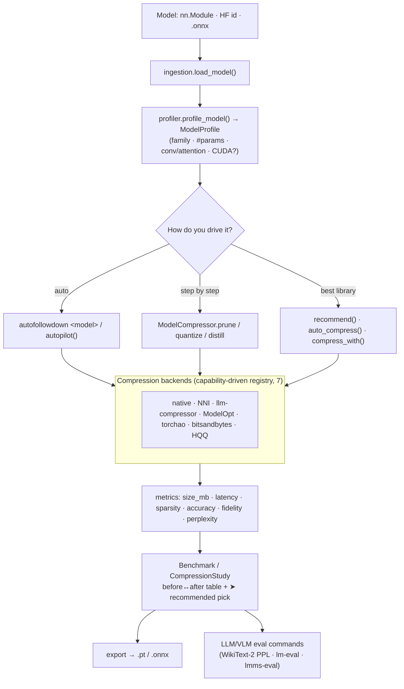

# autofollowdown

[](https://github.com/peetwan/autofollowdown/actions/workflows/tests.yml)
[](https://www.python.org/)
[](LICENSE)
[](CHANGELOG.md)
[](CONTRIBUTING.md)

A unified, simple toolkit for compressing AI models — `quantization`, `pruning`, and
`knowledge distillation` behind one small API — plus a `real benchmark` that measures the
actual impact on size, latency, and accuracy. No mocks: every operation changes real
weights, and every number is measured on a real model.

## Auto-first: just give it a model

The whole tool is built around one idea — **hand it a model and it does the rest**:
profile → compress every way → benchmark → pick the best for your goal → save. It only
stops to ask about the two things it can't decide for you (what you care about, and which
variant to keep), and even those auto-default with `--yes` or a pipe.

```bash
autofollowdown facebook/opt-125m                    # ⭐ just a model → full auto
autofollowdown facebook/opt-125m -o small.pt --yes  # unattended: pick best + save
autofollowdown compress --goal size                 # you set the goal; it picks the smallest
autofollowdown compress --min-retention 0.98        # smallest variant that keeps ≥98% accuracy
```

```
# autofollowdown auto  (offline digits-CNN demo — every variant measured for real)
🤖 autofollowdown autopilot   ·   goal: balanced (override with --goal)
┌───────────────────────────────┬─────────┬──────────┬────────┬───────┬───────┬────────┐
│ Model                         │ Size MB │ Sparsity │   Acc  │ Size× │ Speed×│  ΔAcc  │
├───────────────────────────────┼─────────┼──────────┼────────┼───────┼───────┼────────┤
│ baseline                      │   1.077 │     0.0% │ 90.4%  │   —   │   —   │   —    │
│ int8 dynamic                  │   0.303 │     0.0% │ 90.4%  │ 3.56× │ 0.60× │ +0.0%  │
│ ➤ prune+quantize              │   0.303 │    18.4% │ 91.6%  │ 3.56× │ 0.60× │ +1.1%  │
│ distilled student (1/4 width) │   0.293 │     0.0% │ 74.4%  │ 3.67× │ 5.39× │ -16.0% │
└───────────────────────────────┴─────────┴──────────┴────────┴───────┴───────┴────────┘
🤖 auto: kept 'prune+quantize' for goal 'balanced'   ➤ Selected: prune+quantize
```

At a terminal it offers a quick menu for the goal and the variant (Enter = recommended);
`--yes`, a pipe, or any of `--goal`/`--method`/`--max-size-mb` runs it fully unattended. For
an LLM the quality column is **WikiText-2 perplexity** (and speed is **tokens/sec** from a
real `generate()`), and the pick is made on that — never "smallest regardless of quality".

### 🩺 Stuck? "I can't run this model"

Don't know quantization from distillation? Start from your *problem*. `diagnose` tells you
whether it will fit, what to do, and the exact next command:

```bash
autofollowdown diagnose meta-llama/Llama-3.1-8B --problem won't-fit --vram 8
autofollowdown diagnose Qwen/Qwen3-0.6B --device raspberry-pi-5    # or phone / gpu-8gb / jetson-orin-nano
```

```
Will it fit?   fp16 ~19 GB ✗   int8 ~11 GB ✗   int4 ~7 GB ✓   (weights + fp16 KV + overhead)
→ Only 4-bit fits. Quantize to INT4 (GPTQ/AWQ) — ~4× smaller.  (best library: llm-compressor)
  $ autofollowdown gpu meta-llama/Llama-3.1-8B
  $ autofollowdown compress meta-llama/Llama-3.1-8B -o small.pt
```

The fit numbers are a rough guide (KV cache is modeled in fp16 and ignores context length /
GQA — verify by loading). If it won't fit even at 4-bit it says so and points you to
distillation or free-GPU offloading, and on a CPU target it won't recommend GPU-only 4-bit
nor call a big model "fits" without flagging that it'll be slow. `--problem` ∈ `won't-fit ·
oom · too-slow · too-big · edge · cost`; presets cover Raspberry Pi / Jetson / phone / GPU
tiers. Not sure which technique? `autofollowdown advise <model> --goal {size,speed,accuracy,ease}`
recommends quantize vs prune vs distill, in order, with the *why*.

### Or drive each step yourself

```python
from autofollowdown import ModelCompressor

ModelCompressor(my_model) \
    .prune(sparsity=0.5, method="unstructured") \
    .quantize(method="int8", approach="dynamic") \
    .export("compressed.pt", format="pt")          # chainable, framework-agnostic
```

## Commands

| Command | What it does |
|---------|--------------|
| `autofollowdown <model>` / `compress` / `auto` | ⭐ auto flow: compress every way → benchmark → pick → save |
| `diagnose <model> --problem … --vram …` | 🩺 symptom-first: will it fit, and what to do |
| `advise <model> --goal …` | which technique(s) to use (quantize/prune/distill) + why |
| `recommend <model> --goal …` | best *library* for the model, with the reasoning (`--benchmark` for proof) |
| `gpu <model>` | your GPU + the memory plan to run it on a free/small GPU |
| `info` · `autopick` | backends + benchmark catalog · best-library per model family |
| `benchmark-vision` · `benchmark-llm` | offline CNN benchmark · WikiText-2 LLM perplexity |

A bare model id / `.pt` path (no subcommand) runs the auto flow. Errors print one friendly
line (`AFD_DEBUG=1` for the full traceback).

## Install

Not on PyPI yet, so install from GitHub (the repo is public):

```bash
pip install "git+https://github.com/peetwan/autofollowdown"                              # core
pip install "autofollowdown[examples] @ git+https://github.com/peetwan/autofollowdown"   # + demos
```

In a notebook / Colab, prefix with `!`. Requires Python `>=3.9`, PyTorch `>=2.1`; core deps
(torch, transformers, numpy) install automatically. ONNX export/quant is the optional
`[onnx]` extra (heavy onnxruntime); compression backends are `[torchao]` / `[bnb]` / `[hqq]`.
Once published, this becomes `pip install autofollowdown` (see [Publishing](#publishing-to-pypi)).

### 📓 Notebooks

- **[`showcase`](notebooks/autofollowdown_showcase.ipynb)** — start here: every CLI command in
  ~2 min, each cell running the real CLI with real output (on GitHub).
- **[`cpu_demo`](notebooks/autofollowdown_cpu_demo.ipynb)** — runs entirely on CPU in ~2–3 min:
  the three techniques on a CNN, the one-command benchmark, the auto-picker, and an OPT-125M
  multi-method WikiText-2 comparison.
- **[`demo`](notebooks/autofollowdown_demo.ipynb)** — full walkthrough (core API, one-command
  flow, auto-picker, benchmarks, MMMU/MMLU-ProX, Qwen quant/prune/distill).
- **[`backends_colab`](notebooks/autofollowdown_backends_colab.ipynb)** — Colab T4: install + run
  every backend (native vs NNI vs llm-compressor vs NVIDIA ModelOpt), side by side.
  [](https://colab.research.google.com/github/peetwan/autofollowdown/blob/main/notebooks/autofollowdown_backends_colab.ipynb)

## What it does

| Technique | API | What actually happens |
|-----------|-----|-----------------------|
| Pruning | `.prune(sparsity, method)` | Global L1 magnitude (`unstructured`) or per-channel L2 (`structured`) pruning via `torch.nn.utils.prune`, made permanent so zeros are real |
| Quantization | `.quantize(method, approach)` | INT8 `dynamic` (portable) or FX `static` PTQ with calibration; `fp16`; INT8 on the ONNX graph for `.onnx` inputs |
| Distillation | `.distill(teacher, train_loader, epochs)` | A real KD loop — `KL(soft)+CE(hard)` for classifiers, token-level soft KD over the vocab for causal LMs |
| Export | `.export(path, format)` | `safetensors` (weights, safe — no pickle), `pt` (full torch), or `onnx` (runnable under onnxruntime) |

Inputs accepted: a PyTorch `nn.Module`, a Hugging Face model id, a local `.onnx` file, or a
`.pt` / `.safetensors` checkpoint. **Security:** `.pt` files are pickled, so the advisory
commands profile them safely from the state_dict (no code execution) — pass `--allow-pickle`
only for a file you trust. Prefer exporting `safetensors` (weights, no pickle): it shares and
re-profiles with zero `--allow-pickle`.

## The benchmark

Its point is honesty: it tells you what compression *cost* you. It measures (all real):
parameter count, true sparsity, on-disk size (MB), latency + throughput (for LMs, **tokens/sec
from a real `generate()`**, not a single forward), top-1 accuracy / fidelity, and — for LMs —
**WikiText-2 perplexity**. When no quality signal is available it says so and refuses to crown
a "recommended", rather than silently picking the smallest.

```python
from autofollowdown import Benchmark, ModelCompressor
import copy

bench = Benchmark(example_input, eval_loader=test_loader, reference_model=baseline)
bench.measure(baseline, "baseline (fp32)")
bench.measure(ModelCompressor(copy.deepcopy(baseline)).quantize(approach="dynamic").model, "int8")
print(bench.to_markdown())   # before/after table with size×, speed×, ΔAcc
```

Run the included offline example (`python3 examples/benchmark_digits.py`) — a real CNN on
scikit-learn `digits`, pruned/quantized/distilled:

```
| Model                         | Size (MB) | Sparsity | Lat (ms) | Acc    | Size× | Speed× | ΔAcc   |
| baseline (fp32)               | 1.077     | 0.0%     | 0.64     | 96.00% | —     | —      | —      |
| quantized (int8 dynamic)      | 0.303     | 0.0%     | 1.18     | 96.00% | 3.56× | 0.54×  | +0.00% |
| pruned+quantized              | 0.303     | 17.6%    | 1.17     | 95.78% | 3.56× | 0.55×  | -0.22% |
| distilled student (1/4 width) | 0.293     | 0.0%     | 0.14     | 89.78% | 3.67× | 4.53×  | -6.22% |
```

Honestly: INT8 cuts size `3.56×` with no accuracy loss but is *slower* on a tiny CPU model
(quant/dequant overhead); distillation is `4.5×` faster but trades `~6%` accuracy. Real
tradeoffs, not marketing. Two caveats: pruning zeros weights but dense `.pt`/`.onnx` storage
doesn't shrink from zeros alone (pair it with quantization or a sparse format); and after
torch quantization the packed INT8 weights aren't regular `Parameters`, so `Size (MB)` — not
the `Params` column — is the honest footprint.

## Compressing & evaluating LLMs

For language models, judge compression on two pillars — autofollowdown supports both:
**perplexity** (sliding-window, `evaluate_perplexity`, WikiText-2 default) and **task accuracy**
via EleutherAI's `lm-evaluation-harness` (`lm_eval_command()` builds the exact CLI).

```bash
autofollowdown benchmark-llm --model Qwen/Qwen3-0.6B    # measured: 2274→1164 MB, ppl 20.37→30.36 (int8)
```

That perplexity jump is the point: naive **dynamic INT8 is a quick, portable baseline** but
costs real quality on capable LLMs — which is exactly why weight-only calibrated methods
(GPTQ/AWQ) exist, and why the auto-picker recommends `llm-compressor` / `NVIDIA ModelOpt`
(not native dynamic) for LLMs. (OPT uses `nn.Linear` so INT8 shrinks it; GPT-2's `Conv1D`
barely moves under dynamic quant.)

Standard tasks (matching `lm-eval-harness` ids), from the GPTQ/AWQ/SparseGPT/MINITRON/LLM-KICK literature — `STANDARD_LLM_TASKS`:

| Pillar | Tasks | Measures |
|--------|-------|----------|
| Perplexity | `wikitext2`, `c4`, `ptb` | language-modeling quality |
| Commonsense (0-shot) | `arc_easy`, `arc_challenge`, `hellaswag`, `winogrande`, `piqa`, `openbookqa`, `boolq`, `lambada_openai` | reasoning |
| Knowledge | `mmlu` (5-shot), `mmlu_pro` | factual / advanced reasoning |
| Multilingual | `mmlu_prox_{lang}` / `mmlu_prox_lite_{lang}` (29 languages) | cross-lingual reasoning |
| Reasoning / truth | `gsm8k`, `truthfulqa_mc2` | math / reliability |
| Multimodal (VLMs) | `mmmu_val`, `mmmu_pro` | college-level image+text reasoning |

```python
from autofollowdown import lm_eval_command, multimodal_eval_command, mmlu_prox_tasks, mmmu_tasks
lm_eval_command("./my-model", tasks=mmlu_prox_tasks(["en", "th"], lite=True))   # 29-language MMLU-ProX (lite = 658 Q/lang)
multimodal_eval_command("Qwen/Qwen2-VL-2B-Instruct", tasks=mmmu_tasks())        # MMMU for a compressed VLM (hf-multimodal / lmms-eval)
```

`MMLU-ProX` (EMNLP 2025) and `MMMU` are deliberate "beyond perplexity" checks — compression
can hurt reasoning and low-resource languages more than perplexity shows, so report both pillars.

## Auto-picker & router: the best library for your model

Many libraries each win at something different. autofollowdown profiles your model and ranks
them — and the router is **capability-driven, not hardcoded**: each backend *declares* what it's
good at (families + traits like `fast`/`smallest`/`no-calibration`/`calibrated`), and one generic
scorer combines that with your model and `--goal` (the goal→trait preferences live in the
`GOAL_TRAITS`/`GOAL_AVOID` data maps). Adding a backend is a data entry, not new routing code.

| Backend (alias) | Best for | Technique | Install |
|-----------------|----------|-----------|---------|
| native | anything (fallback, always on) | INT8 dynamic / pruning / distillation | built in |
| Microsoft NNI (`nni`) | CNNs / vision | structured filter pruning + `ModelSpeedup` (real shrink) | `pip install nni` |
| llm-compressor (`llmcompressor`) | HF LLMs | GPTQ/AWQ 4-bit weight-only (`oneshot`) | `pip install llmcompressor` |
| NVIDIA ModelOpt (`modelopt`) | LLMs / transformers | SmoothQuant/AWQ/NVFP4 PTQ → TensorRT | `pip install nvidia-modelopt` (GPU) |
| torchao (`torchao`) | LLMs / any (native) | int8/int4/fp8 + `torch.compile`, no calibration | `pip install torchao` |
| bitsandbytes (`bnb`) | HF LLMs (easiest) | NF4 / INT8 at load time, no calibration | `pip install bitsandbytes` (GPU) |
| HQQ (`hqq`) | HF LLMs | fast 4/3/2-bit, no calibration | `pip install hqq` |

```python
from autofollowdown import explain, recommend, auto_compress, compress_with

print(explain(my_model))                        # ranked backends + why, for this model
compressed, chosen = auto_compress(my_model)    # runs the best *runnable* backend (native fallback)
compress_with(qwen, "llmcompressor", dataset="open_platypus")   # force a specific backend, one line
```

The ranking always shows the *ideal* backend even if it isn't installed, plus the best one you
can run now. `recommend()` is advisory (`autofollowdown recommend <model>` reads an HF config —
**no weight download** — and `--benchmark` adds measured proof); `auto_compress()` /
`compress_with()` execute the real library, or tell you exactly how to enable it.

### Runs on a free GPU 🆓 (automatic)

Quantizing an LLM normally wants a lot of VRAM. The `llmcompressor` backend applies **sequential
onloading** (from llm-compressor's docs) automatically — only one slice of the model sits on the
GPU at a time, the rest waits on CPU/disk; when VRAM is tight it onloads one `Linear` at a time.
Even big models calibrate on a single **free 16 GB T4**. `autofollowdown gpu <model>` shows the
plan; `memory_plan()`, `load_balanced()`, `cuda_info()`, `free_memory()` are the building blocks.

## How it works (architecture & flow)

A thin, honest pipeline: **ingest → profile → compress → measure → recommend → export.**



1. **Ingest** (`ingestion.py`) — normalizes an `nn.Module`, a HF id (right `AutoModel*` class),
   or a `.onnx` file into one representation.
2. **Profile** (`profiler.py`) — returns a `ModelProfile`: family (`llm`/`transformer`/`cnn`/`mlp`),
   param count, conv/attention flags, HF?, CUDA? — what powers the automatic defaults.
3. **Compress** (`api.py` `ModelCompressor`) — real `prune()` (permanent masks), `quantize()`
   (INT8 dynamic/static, picks fbgemm/qnnpack automatically), `distill()` (KD loop; vocab-level
   for causal LMs), `export()`.
4. **Measure** (`metrics.py`) — on-disk size, params, true sparsity, p50 latency, throughput;
   with eval data: accuracy + fidelity; for LMs: WikiText-2 perplexity (`llm_eval.py`).
5. **Recommend** (`benchmark.py` + `pipeline.py`) — `Benchmark` collects before/after rows;
   `best_picks()` marks smallest/fastest/most-accurate/recommended; `pick_best()` honors hard
   constraints; `pareto_frontier()` flags non-dominated variants.
6. **Export / evaluate** — keep the variant you pick; `lm_eval_command()` /
   `multimodal_eval_command()` build the full accuracy-suite commands.

### Ways to drive it (auto-first, same engine underneath)

| Entry point | Use when |
|-------------|----------|
| `autofollowdown <model>` / `autopilot(model)` | the default — just hand it a model |
| `autofollowdown diagnose` / `advise` | you're stuck, or unsure which technique |
| `compress_and_benchmark(m)` → `CompressionStudy` | you want the study object in Python |
| `recommend(m)` / `auto_compress(m)` / `compress_with(m, "nni")` | route to the best library |
| `ModelCompressor(m).prune().quantize().export()` | manual, chained control |

`CompressionStudy` holds the baseline + every variant and the pick API: `.recommended`,
`.pick(name)`, `.best()`, `.pick_best(max_size_mb=…, min_retention=…)`, `.frontier()`,
`.show()`, `.export(...)`, `.to_markdown()`.

## Layout

```
autofollowdown/
  api.py            # ModelCompressor — the unified compression API
  flow.py           # autopilot(): the auto-first orchestrator + choose() (auto/menu)
  pipeline.py       # compress_and_benchmark() + CompressionStudy
  auto.py           # auto-picker: recommend() / explain() / auto_compress() / compress_with()
  backends.py       # capability-driven registry (native + NNI + llm-compressor + ModelOpt + torchao + bnb + HQQ)
  advisor.py        # advise(): which technique (quantize/prune/distill) + backend, and why
  diagnosis.py      # diagnose(): symptom-first help ("I can't run this model") + fit table
  gpu.py            # GPU memory planner — sequential onloading so LLMs run on a free GPU
  profiler.py       # model profiling (family / size / hardware)
  metrics.py        # real measurements (size, latency, accuracy, fidelity)
  benchmark.py      # before/after benchmark engine + "best pick" + Pareto frontier
  llm_eval.py       # LLM perplexity + lm-eval-harness catalog (incl. MMLU-ProX, MMMU)
  ingestion.py · onnx_pipeline.py · graph_tracing.py · demos.py · cli.py
examples/   benchmark_digits.py · benchmark_llm.py · autopick_demo.py
notebooks/  showcase · cpu_demo · demo · backends_colab
tests/      real tests (assert actual effects, not flags)
```

## Tests

```bash
python3 -m pytest -q
```

## Publishing to PyPI

The package is PyPI-ready (`python -m build` → sdist + wheel that pass `twine check`). Automated
(recommended): the `.github/workflows/publish.yml` workflow publishes on every GitHub Release via
PyPI **Trusted Publishing** (OIDC, no stored token). One-time setup on PyPI → project →
*Publishing* (owner `peetwan`, repo `autofollowdown`, workflow `publish.yml`, environment `pypi`),
then `git tag v0.6.0 && git push --tags`. Manual: `python -m build && python -m twine upload dist/*`.

## License

MIT — see [LICENSE](LICENSE).
