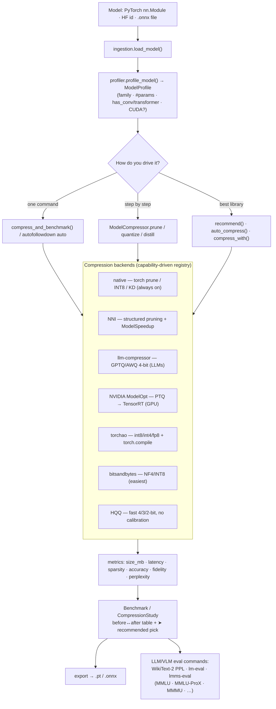

# autofollowdown

[](https://github.com/peetwan/autofollowdown/actions/workflows/tests.yml)
[](https://www.python.org/)
[](LICENSE)
[](CHANGELOG.md)
[](CONTRIBUTING.md)

A unified, simple toolkit for compressing AI models — `quantization`, `pruning`,
and `knowledge distillation` behind one small API — plus a `real benchmark` that
measures the actual impact on size, latency, and accuracy.

No mocks. Every operation changes real weights, and every metric is measured from
a real model running on real data.

## 🩺 Stuck? "I can't run this model"

Don't know quantization from distillation? Start from your *problem*. Tell
`diagnose` what's wrong and your hardware — it says exactly what to do, whether it
will fit, and the next command to run:

```bash
autofollowdown diagnose meta-llama/Llama-3.1-8B --problem won't-fit --vram 8
autofollowdown diagnose Qwen/Qwen3-0.6B --device raspberry-pi-5      # or --device phone / gpu-8gb
autofollowdown diagnose my_model.pt --problem too-slow
```

```
Your problem: it won't fit / runs out of memory
Model ~8000M params; target: your 8 GB target

Will it fit?
  fp16  needs ~ 20.2 GB   ✗ too big
  int8  needs ~ 10.6 GB   ✗ too big
  int4  needs ~  5.8 GB   ✓ fits

→ Only 4-bit fits (~5.8 GB ≤ 8.0 GB). Quantize to INT4 (GPTQ/AWQ) — ~4× smaller.
Do this: INT4 weight-only quantization (GPTQ/AWQ)  (best library: llm-compressor)
Run next:
  $ autofollowdown gpu meta-llama/Llama-3.1-8B
  $ autofollowdown compress meta-llama/Llama-3.1-8B -o small.pt
```

If it won't fit even at 4-bit, it says so honestly and points you to distillation or
free-GPU offloading. Not sure which technique in general? `autofollowdown advise <model>
--goal {size,speed,accuracy,ease}` recommends quantize vs prune vs distill, and why.

## One command does it all

Compress a model every way, benchmark them side by side, and pick the winner —
in a single command:

```bash
autofollowdown auto                       # offline demo (trains a digit CNN)
autofollowdown auto --model facebook/opt-125m --output small.pt
```

```
┌───────────────────────────────┬─────────┬──────────┬────────┬───────┬───────┬────────┐
│ Model                         │ Size MB │ Sparsity │   Acc  │ Size× │ Speed×│  ΔAcc  │
├───────────────────────────────┼─────────┼──────────┼────────┼───────┼───────┼────────┤
│ baseline                      │   1.077 │     0.0% │ 90.4%  │   —   │   —   │   —    │
│ int8 dynamic                  │   0.303 │     0.0% │ 90.4%  │ 3.56× │ 0.60× │ +0.0%  │
│ prune 50%                     │   1.077 │    50.0% │ 91.6%  │ 1.00× │ 1.07× │ +1.1%  │
│ ➤ prune+quantize              │   0.303 │    18.4% │ 91.6%  │ 3.56× │ 0.60× │ +1.1%  │
│ distilled student (1/4 width) │   0.293 │     0.0% │ 74.4%  │ 3.67× │ 5.39× │ -16.0% │
└───────────────────────────────┴─────────┴──────────┴────────┴───────┴───────┴────────┘

➤ Recommended: prune+quantize (3.56× smaller, 91.6% acc)
Pick a method to keep:  [1-5, default 4]:
```

It prompts you to choose (or pass `--method 'prune+quantize' --output model.pt`,
or `--yes` to take the recommendation). Same flow in Python:

```python
from autofollowdown import compress_and_benchmark

study = compress_and_benchmark(model, eval_loader=test_loader)
study.show()                              # table + "which to pick"
study.export(study.recommended, "small.pt")   # or study.pick("int8 dynamic")
```

### Or drive each step yourself

```python
from autofollowdown import ModelCompressor

# chainable, framework-agnostic API
ModelCompressor(my_model) \
    .prune(sparsity=0.5, method="unstructured") \
    .quantize(method="int8", approach="dynamic") \
    .export("compressed.pt", format="pt")
```

## Install

Not on PyPI yet, so install from GitHub (the repo is public):

```bash
pip install "git+https://github.com/peetwan/autofollowdown"                       # core
pip install "autofollowdown[examples] @ git+https://github.com/peetwan/autofollowdown"   # + demos
```

In a notebook / Colab, prefix with `!`:

```python
!pip install "autofollowdown[examples] @ git+https://github.com/peetwan/autofollowdown"
```

Once it's published to PyPI (see [Publishing](#publishing-to-pypi)), this becomes simply
`pip install autofollowdown`. Requires Python `>=3.9`, PyTorch `>=2.1`; core deps (torch,
onnx, onnxruntime, onnxscript, transformers, numpy) install automatically.

### 📓 Notebooks

- [`notebooks/autofollowdown_showcase.ipynb`](notebooks/autofollowdown_showcase.ipynb) —
  **start here: every command in ~2 min.** `install → --help → info → gpu → recommend →
  compress → autopick`, each cell running the real CLI with real output (on GitHub). Shows the
  memory-saving plan that runs big LLMs on a **free** GPU.
- [`notebooks/autofollowdown_cpu_demo.ipynb`](notebooks/autofollowdown_cpu_demo.ipynb) —
  **runs entirely on CPU in ~2–3 min, no GPU.** Real results (outputs on GitHub): the three
  techniques on a CNN, the one-command benchmark, the auto-picker, and an OPT-125M
  **method comparison** on WikiText-2 perplexity (baseline vs INT8 vs pruning vs pruned+INT8 —
  so you can see it really compares methods, not just one). The quickest way to see it work.
- [`notebooks/autofollowdown_demo.ipynb`](notebooks/autofollowdown_demo.ipynb) — runnable
  walkthrough of everything, with outputs you can see right on GitHub (core API,
  one-command flow, auto-picker, benchmarks, MMMU/MMLU-ProX, and Qwen quant/prune/distill).
- [`notebooks/autofollowdown_backends_colab.ipynb`](notebooks/autofollowdown_backends_colab.ipynb)
  — the **full backend flow with real results**: profile → `recommend` (why) → run every
  backend via `compress_with` → side-by-side comparison. An LLM library shoot-out on Qwen
  (native INT8 vs llm-compressor 4-bit GPTQ vs NVIDIA ModelOpt INT8, scored on WikiText-2
  perplexity) plus a vision track (native vs NNI structured pruning). Built for a Colab T4:

  [](https://colab.research.google.com/github/peetwan/autofollowdown/blob/main/notebooks/autofollowdown_backends_colab.ipynb)

### Try it in one command

```bash
autofollowdown diagnose <model> --problem won't-fit --vram 8   # 🩺 stuck? start here
autofollowdown advise <model> --goal size               # which technique(s) to use + why
autofollowdown compress facebook/opt-125m -o small.pt   # ⭐ compress, benchmark, pick, save
autofollowdown compress                                 # offline demo (no model needed)
autofollowdown recommend Qwen/Qwen3-0.6B --goal accuracy   # best library for your LLM (+ why)
autofollowdown gpu Qwen/Qwen3-0.6B                      # GPU + memory plan to run it on a free GPU
autofollowdown info                                     # version, backends, benchmark catalog
autofollowdown benchmark-vision                         # real CNN benchmark (offline)
autofollowdown benchmark-llm                            # real LLM perplexity benchmark
autofollowdown autopick                                 # best-library recommendation per model
```

`compress` is the easy headline command: give it any model (a Hugging Face id or a
`.pt` file), it compresses it every way, benchmarks them, recommends the best, and —
with `-o` — saves the variant you pick. Run it with no model for the offline demo.

## What it does

| Technique | API | What actually happens |
|-----------|-----|-----------------------|
| Pruning | `.prune(sparsity, method)` | Global L1 magnitude (`unstructured`) or channel (`structured`) pruning via `torch.nn.utils.prune`, made permanent so zeros are real |
| Quantization | `.quantize(method, approach)` | INT8 `dynamic` (portable) or FX `static` PTQ with calibration; INT8 on the ONNX graph for `.onnx` inputs |
| Distillation | `.distill(teacher, train_loader, epochs)` | A real KD training loop (KL on softened logits + CE on labels) that updates the student |
| Export | `.export(path, format)` | Real `.pt` (torch) or `.onnx` (runnable under onnxruntime) |

Inputs accepted: a PyTorch `nn.Module`, a Hugging Face model id, or a local `.onnx` file.

## The benchmark

The point of the benchmark is honesty: it tells you what compression cost you.

```python
from autofollowdown import Benchmark, ModelCompressor
import copy

bench = Benchmark(example_input, eval_loader=test_loader, reference_model=baseline)
bench.measure(baseline, "baseline (fp32)")

quant = ModelCompressor(copy.deepcopy(baseline)).quantize(approach="dynamic").model
bench.measure(quant, "quantized int8")

print(bench.to_markdown())   # before/after table with size×, speed×, ΔAcc
```

It measures (all real): parameter count, true sparsity, on-disk size (MB), p50
inference latency, throughput, top-1 accuracy, and output fidelity vs the baseline.

### Run the included example (offline, no download)

```bash
python3 examples/benchmark_digits.py --epochs 8
```

It trains a real CNN on the scikit-learn `digits` dataset, then prunes / quantizes /
distills it. Sample output:

```
| Model                         | Size (MB) | Sparsity | Latency (ms) | Acc    | Size× | Speed× | ΔAcc   |
|-------------------------------|-----------|----------|--------------|--------|-------|--------|--------|
| baseline (fp32)               | 1.077     | 0.0%     | 0.64         | 96.00% | —     | —      | —      |
| pruned 50% (unstructured)     | 1.077     | 50.0%    | 0.68         | 96.00% | 1.00× | 0.95×  | +0.00% |
| quantized (int8 dynamic)      | 0.303     | 0.0%     | 1.18         | 96.00% | 3.56× | 0.54×  | +0.00% |
| pruned+quantized              | 0.303     | 17.6%    | 1.17         | 95.78% | 3.56× | 0.55×  | -0.22% |
| distilled student (1/4 width) | 0.293     | 0.0%     | 0.14         | 89.78% | 3.67× | 4.53×  | -6.22% |
```

What this honestly shows: INT8 cuts size `3.56×` with no accuracy loss but is *slower*
on a tiny CPU model (quant/dequant overhead); distillation is `4.5×` faster and
smaller but trades `~6%` accuracy. Real tradeoffs, not marketing.

#### Works on bigger models too (Qwen `< 8B`)

```bash
autofollowdown benchmark-llm --model Qwen/Qwen3-0.6B     # 1.7B / 3B too; GPU for >1B
```

Real measured output (Qwen3-0.6B, 596M params, WikiText-2):

```
| Model            | Size (MB) | Perplexity↓ | Size× | ΔPPL   |
| Qwen3-0.6B fp32  | 2274      | 20.37       |  —    |  —     |
| int8 dynamic     | 1164      | 30.36       | 1.95× | +10.00 |
```

Honest caveat: naive **dynamic INT8 is a quick, portable baseline** — but it costs real
quality on capable LLMs (note the perplexity jump). That's why weight-only, calibrated
methods (GPTQ / AWQ) exist, and why the auto-picker recommends `llm-compressor` or
`NVIDIA ModelOpt` (not native dynamic) for LLMs.

Caveats worth knowing:
- Pruning zeros weights but dense `.pt`/`.onnx` storage does not shrink from zeros
  alone — pair pruning with quantization or a sparse format to save space.
- After torch quantization, packed INT8 weights are not regular `Parameters`, so the
  `Params`/`Sparsity` columns reflect only the remaining float tensors. `Size (MB)`
  is the honest footprint metric.

## Benchmarking compressed LLMs

For language models the field judges compression (quantization / pruning /
distillation) on two pillars — and autofollowdown supports both:

1. Perplexity (lower = better) on held-out text. `WikiText-2` is the universal
   default; `C4` and `PTB` are also common. Implemented for real here via the
   standard sliding-window method (`evaluate_perplexity`).
2. Zero-shot / few-shot task accuracy via EleutherAI's `lm-evaluation-harness`
   (the community standard). `lm_eval_command()` builds the exact CLI.

Standard datasets/tasks (matching `lm-eval-harness` task ids), from the GPTQ,
AWQ, SparseGPT, LLMCBench, LeanQuant, NVIDIA MINITRON and Apple LLM-KICK papers:

| Pillar | Datasets / tasks | Measures |
|--------|------------------|----------|
| Perplexity | `wikitext2`, `c4`, `ptb` | language-modeling quality |
| Commonsense (0-shot) | `arc_easy`, `arc_challenge`, `hellaswag`, `winogrande`, `piqa`, `openbookqa`, `boolq`, `lambada_openai` | reasoning / commonsense |
| Knowledge (5-shot) | `mmlu` | broad factual knowledge |
| Advanced knowledge | `mmlu_pro` | harder 10-choice reasoning |
| Multilingual | `mmlu_prox_{lang}` / `mmlu_prox_lite_{lang}` (29 languages) | cross-lingual reasoning |
| Reasoning | `gsm8k` | math word problems |
| Truthfulness | `truthfulqa` | reliability |
| Multimodal (VLMs) | `mmmu_val` / `mmmu_pro` | image+text college-level reasoning |

`MMMU` evaluates **vision-language models** (e.g. Qwen-VL, LLaVA) on 11.5K college-level
image+text questions across 30 subjects (accuracy). Compress a VLM with autofollowdown,
then evaluate it on MMMU via the multimodal harness — `multimodal_eval_command()` builds
the CLI for EleutherAI `lm-eval` (`--model hf-multimodal`) or `lmms-eval`:

```python
from autofollowdown import multimodal_eval_command, mmmu_tasks
print(multimodal_eval_command("Qwen/Qwen2-VL-2B-Instruct", tasks=mmmu_tasks()))
# lm_eval --model hf-multimodal --model_args pretrained=...,max_images=1,interleave=True \
#   --tasks mmmu_val --apply_chat_template --device cuda:0 --batch_size auto
```

`MMLU-ProX` (EMNLP 2025) extends MMLU-Pro to 29 languages with parallel questions
— a strong "beyond perplexity" check, since compression can hurt reasoning and
low-resource languages more than perplexity shows. Build its task ids with
`mmlu_prox_tasks(["en", "th", "zh"], lite=True)` (the `lite` set is 658 Q/language,
ideal for quickly vetting a compressed model).

Caveat from the literature (Apple LLM-KICK, ACL'24 survey): perplexity is the
quick standard but imperfect — pruning degrades knowledge tasks more than
perplexity suggests, and quantization usually preserves accuracy better than
pruning at equal compression. Report both pillars.

### Run it (real perplexity, real model)

```bash
pip install datasets            # for real WikiText-2
python3 examples/benchmark_llm.py --model facebook/opt-125m
```

Real measured output (OPT-125M, WikiText-2):

```
| Model           | Size (MB) | Perplexity↓ | Latency (ms) | Size× | Speed× | ΔPPL   |
| baseline (fp32) | 477.8     | 32.761      | 16.0         | —     | —      | —      |
| int8 dynamic    | 271.9     | 34.625      | 18.6         | 1.76× | 0.86×  | +1.864 |
```

INT8 cuts size `1.76×` for a small `+1.86` perplexity cost — the kind of honest
tradeoff the benchmark exists to show. (Tip: OPT uses `nn.Linear`, so INT8
dynamic compresses it; GPT-2 uses `Conv1D` and barely shrinks under dynamic quant.)

### Full accuracy suite via lm-evaluation-harness

```python
from autofollowdown import lm_eval_command, STANDARD_LLM_TASKS, mmlu_prox_tasks
print(lm_eval_command("./my-compressed-model",
                      tasks=STANDARD_LLM_TASKS["commonsense_zeroshot"]
                            + mmlu_prox_tasks(["en", "th"], lite=True)))
# lm_eval --model hf --model_args pretrained=./my-compressed-model \
#   --tasks arc_easy,...,hellaswag,mmlu_prox_lite_en,mmlu_prox_lite_th --device cuda:0 --batch_size auto
```

## Auto-picker: best library for your model

There are many compression libraries, each best at something different. autofollowdown
profiles your model and recommends (and can run) the best one for it — falling back
to the always-available native engine when an optional library isn't installed.

The router is **capability-driven, not hardcoded**: every backend *declares* what it's
good at (which model families, which traits — `fast` / `smallest` / `no-calibration` /
`calibrated` …), and a single generic scorer ranks them against your model and your
`--goal`. Adding a backend is a data entry, not new routing code — so the ranking stays
transparent and easy to extend.

```python
from autofollowdown import explain, recommend, auto_compress

print(explain(my_model))                 # ranked backends + why, for this model
compressed, chosen = auto_compress(my_model)   # runs the best runnable backend
print("picked:", chosen.backend, chosen.scheme)
```

```
Model profile: ModelProfile(family=cnn, params=78,442, conv=True, transformer=False, ...)

Ranked compression backends:
    1. [0.90] Microsoft NNI: L1FilterPruner + ModelSpeedup — not installed   (pip install nni)
 →  2. [0.60] autofollowdown (native): unstructured-0.5 + int8-dynamic — runnable
    3. [0.60] NVIDIA TensorRT Model Optimizer: INT8 PTQ — not installed (needs NVIDIA GPU)

Auto-pick (runnable now): autofollowdown (native)
```

Backends and what they're chosen for:

| Backend | Best for | Technique | Requirement |
|---------|----------|-----------|-------------|
| autofollowdown (native) | anything (fallback) | INT8 dynamic / pruning / distillation | built in |
| Microsoft NNI | CNNs / vision | structured filter pruning + `ModelSpeedup` (real shrink) | `pip install nni` |
| llm-compressor (vLLM) | HF LLMs | GPTQ/AWQ 4-bit weight-only (`oneshot`) | `pip install llmcompressor` (GPU) |
| NVIDIA ModelOpt | LLMs / transformers | SmoothQuant/AWQ/NVFP4 PTQ → TensorRT | `pip install nvidia-modelopt` (NVIDIA GPU) |
| torchao | LLMs / any (native) | int8/int4/fp8 weight-only + `torch.compile`, no calibration | `pip install torchao` |
| bitsandbytes | HF LLMs (easiest) | NF4 / INT8 at load time, no calibration | `pip install bitsandbytes` (GPU) |
| HQQ | HF LLMs | fast 4/3/2-bit, no calibration | `pip install hqq` |

The ranking always shows the *ideal* backend even if it isn't installed, plus the
best one you can run right now. `recommend()` is advisory; `auto_compress()` executes.
Pass `--goal {balanced,accuracy,size,speed,ease}` to route by what you care about — e.g.
`--goal ease` surfaces the no-calibration backends (torchao / HQQ / bitsandbytes).

#### Find the best library for your LLM — and see *why*

`autofollowdown recommend <model>` is the advisor command: point it at any model
(a Hugging Face id — read from its **config only, no weight download** — or a `.pt`),
and it ranks the libraries, explains the reasoning, and tells you the best pick for your
goal. Add `--benchmark` to download the model and show the **measured** evidence behind
the recommendation.

```bash
autofollowdown recommend Qwen/Qwen3-0.6B --goal accuracy
```

```
Model: Qwen/Qwen3-0.6B   family=llm · params=~537M (est.) · HF=True · CUDA=False
┌───┬─────────────────────────────────┬──────┬───────────────┬──────────────────┐
│ # │ Library                         │  Fit │ Status        │ Method           │
│ 1 │ llm-compressor (vLLM)           │ 0.95 │ not installed │ GPTQ W4A16       │
│ 2 │ NVIDIA TensorRT Model Optimizer │ 0.90 │ not installed │ INT8 SmoothQuant │
│ 3 │ autofollowdown (native)         │ 0.40 │ runnable here │ int8-dynamic     │
│ 4 │ Microsoft NNI                   │ 0.20 │ not installed │ L1 + ModelSpeedup│
└───┴─────────────────────────────────┴──────┴───────────────┴──────────────────┘
➤ Best library for this model: llm-compressor (vLLM) — GPTQ W4A16
  Runnable right now: autofollowdown (native) — int8-dynamic (install llmcompressor for the best)
  For your goal 'accuracy': weight-only 4-bit GPTQ/AWQ preserves accuracy best ...
```

With `--benchmark` it adds the proof — e.g. *“native INT8 costs +10.0 perplexity on this
model, which is exactly why we recommend weight-only GPTQ/AWQ for LLMs.”* `--goal` accepts
`balanced` / `accuracy` / `size` / `speed`.

#### Use a specific connected backend in one line

`compress_with(model, backend)` runs the real library (by name or alias) — it executes
the moment the library is installed and the hardware suits it, and otherwise tells you
exactly how to enable it. The same call works on a CNN (NNI) or an LLM like Qwen:

```python
from autofollowdown import compress_with

compress_with(cnn,  "nni", dummy_input=x)                       # NNI structured pruning + ModelSpeedup
compress_with(qwen, "llmcompressor",                            # GPTQ/AWQ 4-bit (vLLM-ready)
              recipe=GPTQModifier(targets="Linear", scheme="W4A16"), dataset="open_platypus")
compress_with(qwen, "modelopt", calibration_data=calib)         # NVIDIA SmoothQuant/NVFP4 PTQ (GPU)
```

Try it: `python3 examples/autopick_demo.py` — and the demo notebook calls `compress_with`
on both a CNN and Qwen so you can see each backend's exact invocation.

### Runs on a free GPU 🆓 (memory-saving, automatic)

Quantizing an LLM normally wants a lot of VRAM. autofollowdown applies the technique from
llm-compressor's own docs — **sequential onloading** — so it doesn't have to: only one slice
of the model sits on the GPU at a time while the rest waits on CPU/disk. When VRAM is tight it
drops to onloading **one `Linear` at a time** (`sequential_targets="Linear"`). The result: even
big models calibrate on a single **free 16 GB Colab/Kaggle T4** — just a bit slower.

It's automatic — the `llmcompressor` backend picks these settings from the model size and your
free VRAM. `autofollowdown gpu <model>` shows you the plan first:

```bash
autofollowdown gpu Qwen/Qwen3-0.6B     # GPU detected + the exact pipeline/targets it will use
```

```python
from autofollowdown import cuda_info, memory_plan, free_memory, load_balanced

cuda_info()                            # {'available': True, 'name': 'Tesla T4', 'free_gb': 14.8, ...}
plan = memory_plan(7e9, vram_gb=16)    # -> pipeline='sequential', device_map='auto' (offloads the rest)
model = load_balanced("Qwen/Qwen3-0.6B")   # device_map='auto' so a model bigger than VRAM still loads
free_memory()                          # release cached VRAM between methods so the next one doesn't OOM
```

## How it works (architecture & flow)

autofollowdown is a thin, honest pipeline: **ingest → profile → compress → measure →
recommend → export**. Everything operates on a real model and every number is measured.



### The stages

1. **Ingest** (`ingestion.py`) — accepts a PyTorch `nn.Module`, a Hugging Face model id
   (loaded with the right `AutoModel*` class), or a path to a local `.onnx` file, and
   normalizes them to one internal representation.
2. **Profile** (`profiler.py`) — inspects the model and returns a `ModelProfile`: its
   *family* (`llm` / `transformer` / `cnn` / `mlp`), parameter count, whether it has
   conv/attention layers, whether it's a Hugging Face model, and whether CUDA is present.
   This is what lets the toolkit choose sensible defaults automatically.
3. **Compress** (`api.py` `ModelCompressor`) — applies real operations to the weights:
   - `prune()` — global L1 magnitude (unstructured) or per-channel L2 (structured) pruning
     via `torch.nn.utils.prune`, made **permanent** (the mask is folded in, so zeros are real).
   - `quantize()` — INT8 `dynamic` (portable) or FX `static` PTQ; INT8 on the ONNX graph
     for `.onnx` inputs. (Picks the right CPU quant engine automatically — fbgemm/qnnpack.)
   - `distill()` — a real knowledge-distillation training loop. For classifiers it's
     `KL(soft) + CE(hard)`; for **causal LMs** it switches to token-level soft KD over the
     vocab, so it works on models like Qwen.
   - `export()` — real `.pt` (torch) or `.onnx` (runnable under onnxruntime).
4. **Measure** (`metrics.py`) — for any model: on-disk size (MB, serialized to a temp file so
   multi-GB LLMs don't blow up RAM), parameter count, true sparsity, p50 latency, throughput;
   with eval data: top-1 accuracy and output fidelity (agreement with the original); for LMs:
   sliding-window WikiText-2 perplexity (`llm_eval.py`).
5. **Recommend** (`benchmark.py` + `pipeline.py`) — `Benchmark` collects before/after rows;
   `best_picks()` scores variants (accuracy-weighted compression) and marks the **smallest,
   fastest, most-accurate, and recommended** options; `to_table()` renders the box-drawing
   terminal table with the recommended row highlighted.
6. **Export / evaluate** — keep the variant you pick (`study.export(...)`); for LLMs/VLMs,
   `lm_eval_command()` / `multimodal_eval_command()` build the exact harness commands to run
   the full accuracy suite (ARC, MMLU, MMLU-ProX, GSM8K, MMMU, …).

### Three ways to drive it (same engine underneath)

| Entry point | What it does | Use when |
|-------------|--------------|----------|
| `ModelCompressor(m).prune().quantize().export()` | manual, chained control | you know exactly what you want |
| `compress_and_benchmark(m)` / `autofollowdown auto` | runs all methods, benchmarks, recommends, lets you pick | you want the best variant chosen for you |
| `recommend(m)` / `auto_compress(m)` / `compress_with(m, "nni")` | profiles the model and routes to the best *library* | you want the strongest method available on your hardware |

### Backend registry (`backends.py`)

Each backend declares a `Capability` as **data** — which model families it suits, its traits
(`fast` / `smallest` / `no-calibration` / `calibrated` …), whether it needs a GPU or a
calibration set — plus a real `compress()` that calls the library's documented API. One generic
scorer turns those declarations + the model profile + your goal into a fitness number (the
goal→trait preferences live in the `GOAL_TRAITS` / `GOAL_AVOID` data maps), so **routing has no
per-backend hardcoded rules and a new backend is a data entry, not new branching code**.

The **native** backend is always available; `NNI`, `llm-compressor`, `NVIDIA ModelOpt`,
`torchao`, `bitsandbytes`, and `HQQ` register only when installed. `auto_compress` runs the
highest-scoring *runnable* backend (falling back to native); `compress_with(model, "alias")`
forces a specific one — running the real library when present, or telling you exactly how to
enable it.

### Data objects you'll see

- `ModelProfile` — the model's family / size / hardware fingerprint.
- `CompressionStudy` — holds the baseline + every compressed variant, their benchmark, and the
  pick API (`.recommended`, `.pick(name)`, `.best()`, `.export(...)`, `.show()`).
- `Recommendation` — one ranked backend (score, runnable?, rationale, install hint).

## Layout

```
autofollowdown/
  api.py            # ModelCompressor — the unified compression API
  pipeline.py       # compress_and_benchmark() + CompressionStudy (the one-command flow)
  auto.py           # auto-picker: recommend() / explain() / auto_compress()
  advisor.py        # advise(): which technique (quantize/prune/distill) + backend, and why
  diagnose.py       # diagnose(): symptom-first help ("I can't run this model") + fit table
  gpu.py            # GPU memory planner — sequential onloading so LLMs run on a free GPU
  backends.py       # backend registry (native + NNI + llm-compressor + ModelOpt)
  profiler.py       # model profiling (family / size / hardware)
  metrics.py        # real measurements (size, latency, accuracy, fidelity)
  benchmark.py      # before/after benchmark engine + "best pick" recommendation
  llm_eval.py       # LLM perplexity + lm-eval-harness catalog (incl. MMLU-ProX)
  ingestion.py      # load PyTorch / Hugging Face / ONNX
  onnx_pipeline.py  # ONNX export + onnxruntime quant/prune
  graph_tracing.py  # torch.fx tracing + Conv/BN/ReLU fusion
  demos.py          # packaged benchmark runners (shared by CLI + examples)
  cli.py            # `autofollowdown` command-line interface
examples/
  benchmark_digits.py   # real before/after benchmark (offline, vision)
  benchmark_llm.py      # real LLM perplexity benchmark (WikiText-2)
  autopick_demo.py      # auto-pick the best backend per model
notebooks/
  autofollowdown_showcase.ipynb        # every CLI command in ~2 min (real output) — start here
  autofollowdown_cpu_demo.ipynb        # CPU-only demo, real outputs, ~1–2 min (no GPU)
  autofollowdown_demo.ipynb            # runnable walkthrough of the whole toolkit
  autofollowdown_backends_colab.ipynb  # Colab T4: install + run NNI / llm-compressor / ModelOpt
tests/              # real tests (assert actual effects, not flags)
```

## Tests

```bash
python3 -m pytest -q
```

## Publishing to PyPI

The package is fully PyPI-ready (`python -m build` produces an sdist + wheel that pass
`twine check`). Two ways to publish so `pip install autofollowdown` works for everyone:

Automated (recommended) — a GitHub Actions workflow (`.github/workflows/publish.yml`)
publishes on every GitHub Release using PyPI **Trusted Publishing** (OIDC, no token to
store). One-time setup: on PyPI → your project → *Publishing*, add a trusted publisher
(owner `peetwan`, repo `autofollowdown`, workflow `publish.yml`, environment `pypi`).
Then:

```bash
git tag v0.3.0 && git push --tags      # or click "Draft a new release" on GitHub
```

Manual:

```bash
python -m pip install build twine
python -m build                        # dist/*.whl + dist/*.tar.gz
python -m twine upload dist/*          # prompts for your PyPI token
```

## License

MIT — see [LICENSE](LICENSE).
